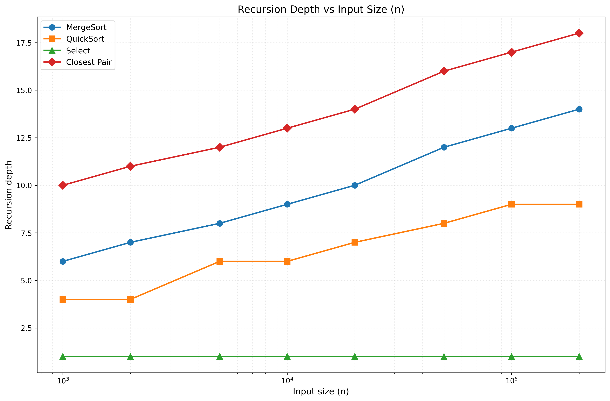

# Divide and Conquer Algorithms

## Assignment Goals
- Implement classic divide-and-conquer algorithms with safe recursion patterns.  
- Analyze running-time recurrences using Master Theorem (3 cases) and Akra–Bazzi intuition; validate with experimental measurements.  
- Collect metrics (time, recursion depth, comparisons/allocations) and report results with plots and discussion.  
- Maintain clean Git history with feature branches and proper commit storyline.  
---
### Execution Time (time vs. n)

Parameters (English):
- **X**: Input size `n`
- **Y**: Execution time (ms)
- **Lines**: Merge Sort, QuickSort, Select, Closest Pair.

**Observations:**
- **MergeSort**: Shows consistent O(n log n) performance
- **QuickSort**: Faster than MergeSort on average, but with more variability.
- **Select**: Shows a linear O(n) scheme for finding the median.
- **ClosestPair**: Has O(n log n) performance, but with the specified constants.

### Recursion depth (depth vs. n)

Parameters (English):
- **X**: Input size `n`
- **Y**: Recursion depth.
- **Lines**: Merge sort, quicksort, selection, closest pair.

**Observations:**
- **MergeSort**: Recursion depth grows as log₂(n)
- **QuickSort**: Depth depends on the quality of the pivot selection.
- **Select**: Very shallow recursion depth due to deterministic selection.
- **ClosestPair**: Depth grows as log₂(n) due to bisection

---

## Implemented Algorithms
### 1. MergeSort (D&C, Master Case 2)
- Linear merge with reusable buffer.  
- Small-n cutoff (insertion sort for base case).  
- Recursion depth controlled and bounded.  

### 2. QuickSort (robust)
- Randomized pivot selection.  
- Always recurse into the smaller partition, iterate over the larger one.  
- Typical recursion depth: O(log n) with high probability.  

### 3. Deterministic Select (Median of Medians, O(n))
- Partition by groups of 5; median of medians as pivot.  
- In-place partition.  
- Recurse only into the needed side (prefer smaller side).  

### 4. Closest Pair of Points (2D, O(n log n))
- Recursive split by x-coordinate.  
- Strip check by y-order (classic 7–8 neighbor scan).  

---

## Report Notes
- **Architecture**: recursion depth carefully controlled; allocations minimized with reusable buffers.  
- **Recurrence analysis**:  
  - MergeSort: T(n) = 2T(n/2) + Θ(n) ⇒ Θ(n log n).  
  - QuickSort: T(n) = T(k) + T(n−k−1) + Θ(n) ⇒ expected Θ(n log n).  
  - Select (MoM5): T(n) = T(n/5) + T(7n/10) + Θ(n) ⇒ Θ(n).  
  - Closest Pair: T(n) = 2T(n/2) + Θ(n) ⇒ Θ(n log n).  
- **Plots**:  
  - Running time vs input size.  
  - Recursion depth vs input size.  
  - Comparison between theoretical predictions and empirical results.  
- **Summary**: analysis of constant-factor effects (cache, GC) and mismatch/alignment between theory and practice.  

---

## Git Workflow
### Branches
- `main` → release versions (`v0.1`, `v1.0`).  
- `feature/mergesort`, `feature/quicksort`, `feature/select`, `feature/closest`, `feature/metrics`.  

### Commit Storyline
- `init`: maven, junit5, ci, readme.  
- `feat(metrics)`: counters, depth tracker, CSV writer.  
- `feat(mergesort)`: baseline + reusable buffer + cutoff + tests.  
- `feat(quicksort)`: randomized pivot + smaller-first recursion + tests.  
- `refactor(util)`: partition, swap, shuffle, guards.  
- `feat(select)`: deterministic select (MoM5) + tests.  
- `feat(closest)`: divide-and-conquer closest pair + tests.  
- `feat(cli)`: parse args, run algorithms, export CSV.  
- `bench(jmh)`: harness for select vs sort.  
- `docs(report)`: recurrence analysis, plots, discussion.  
- `fix`: edge cases (duplicates, tiny arrays).  
- `release`: v1.0.  

---

## Testing
- **Sorting**: correctness on random and adversarial arrays; recursion depth bounded (QuickSort depth ≤ O(log² n) with randomized pivot).  
- **Select**: compared with `Arrays.sort(a)[k]` across 100 random trials.  
- **Closest Pair**: validated against brute-force O(n²) for small n ≤ 2000, then used fast version on large n.  
